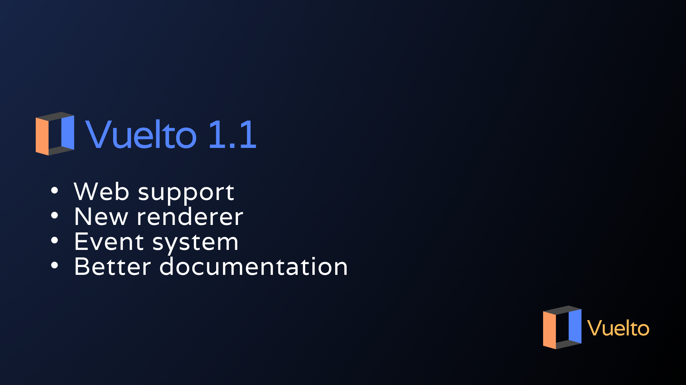

# Vuelto 1.1 released\! Here's what's new



Hi there! Happy new year to everyone. We’re *a bit* late, but still hyped to give you everyone this year’s gift: **Vuelto 1.1!** While it’s a *minor* update from a user perspective, it’s a whole revamp of Vuelto’s internals, bringing - among other things - support for making web-based games from the same codebase! We also improved performance, made the groundwork for the now available events system, and even more. So let's dive into it!

<!-- more -->
## The new Vuelto renderer

Vuelto 1.0’s legacy renderer uses a pipelined system for rendering graphics. It looks kinda like this:  

```go
// ...
gl.Vertex2f(x, y)
gl.Vertex2f(x+width, y)
gl.Vertex2f(x+width, y+height)
gl.Vertex2f(x, y+height)
// ...
```

Vuelto 1.1 refactored the rendering system, using OpenGL 3.3 Core and taking a shader based approach like this:

```go  
vertexShader := NewShader(VERTEX_SHADER, "vertex_shader_web.glsl", "vertex_shader_desktop.glsl")  
fragmentShader := NewShader(FRAGMENT_SHADER, "fragment_shader_web.glsl", "fragment_shader_desktop.glsl")

vertexShader.Compile()
fragmentShader.Compile()

program := NewProgram(*vertexShader, *fragmentShader)
program.Link()
program.Use()
```

This brings in performance improvements and sets the groundwork for supporting advanced features like material textures in future versions.

!!! note
    Keep in mind GL 3.3 is not compatible with super old hardware. The legacy renderer has been removed, so you’ll have to stick with it.

## Web support

Now Vuelto is capable of compiling your games to both the desktop with GLFW and the web with WebAssembly and WebGL from the same codebase! That’s made possible thanks to a bunch of refactors to the widowing system that, besides improving code maintainability, made this possible. All features supported by Vuelto will work seamlessly on the web, we’ll take care of code splitting and conversion everywhere possible.

There are two exceptions for this, as of now:

- Images won’t work on the web by default. If you’re targeting web & desktop at the same time, a small different approach is needed.
- Games that launch more than one window won’t work on the web at all.

In the end, as long as you don’t open two windows on the web and use `ImageEmbed` instead of an image path (more onto that later), your Vuelto games are now fully cross-platform: Linux, Windows, macOS, and the web.

## Enhanced windowing and rendering

We just told you that we refactored the windowing system. This doesn’t only bring the almighty web support, but also adds **framerate management**. You can now get the framerate of your game with `window.GetFPS()`, or even better, you can **set your window’s framerate** with `window.SetFPS()`.

And besides that, a function most game devs can’t get off their head and somehow wasn’t in Vuelto - until now. **`window.GetDeltaTime()`**! Finally, we brought this good boy in.

Another change, regarding the previously mentioned image support for the web, is that now images support embedding.

The classic way to render an image in Vuelto is to go this:

```go
image := renderer.LoadImage("path/to/image.png", 10, 10, 50, 50) // returns an Image (internal type)
```

This works fine, but only on the desktop. For an image that works both on the desktop and the web, you’ll need an ImageEmbed instead of a file path.

An ImageEmbed struct takes two parameters, Filesystem, which should always be embed.FS, and then the filename of the image to use.

```go
var embeddedFiles embed.FS

imageEmbed := vuelto.ImageEmbed{
    Filesystem: embeddedFiles,
    Image:      "image.png",
}

image := renderer.LoadImage(imageEmbed, 0, 0, 1, 1)
```

Once loaded like this, you can just do image.Draw(), and you now got a web-proof image on screen.

## Events system

As promised in our birthday blog post, we’re bringing events to Vuelto. They are still basic, but the groundwork made so far is sufficient for making v1.1 a great release, and also sets a base we’ll build on top of in the following releases. For now you can get **key press** and **key release** events reactively, and the **mouse position** imperatively.

Key press & release events are used like this:  

```go
if KeyPressed(“E”) == true {
 fmt.Println(“you pressed it”)
}
// ...
if KeyReleased(“E”) {
 fmt.Println(“you’re not pressing it”)
}
```

We said you can get these “reactively” because the boolean return of both functions immediately switches as soon as the user toggles the event. `”you pressed it”` will be immediately printed each time I press `E`, as each time the event is fired, the state of the function changes, firing the code inside the `if` block. The same happens with release events, each time I release the `E` key, `”you’re not pressing it”` would print.

Keep in mind code inside `if KeyPressed(“E”)` will fire multiple times - one per frame, actually. `KeyPressed(“E”)` will stay true until I release the key, and the window’s life-cycle itself is a loop, so events get fired repeatedly.

If you need to fire code only once, you can use `KeyPressedOnce(“E”)`.

Besides these, we also have `MousePos()` (not *Get*MousePos())  

```go
position := window.MousePos() // imagine X is 20 and Y is 30  
```

From here, we can access `position.X`, which will return 20, `position.Y`, which will return 30, and `position.Pos()` to get both together as `20, 30`.

Keep in mind the `position` variable won’t change as the window refreshes. That’s why we said *you can get it “imperatively”*. `MousePos()` returns the value for the moment of the call and doesn’t update it, so you’ll have to call `MousePos()` exactly where you want to use it (or just use some sort of loop).

## Better documentation

Vuelto 1.0 was, to be honest, almost documentation less. We’ve fixed that! Here, at vuelto.pp.ua, Vuelto 1.1 is now fully documented and includes code examples, easy to follow explanations on core concepts such as the game loop, and more. All of that with that nicely refreshed branding we told you about on our last (and first too!) blog post. It’s something to be proud of, isn’t it?  
—
And that’s all, my fellows! We hope you’re as excited to try out Vuelto 1.1 as we are to release it right now. See the full release notes at our [CHANGELOG.md file](https://github.com/vuelto-org/vuelto/blob/main/CHANGELOG.md), and have fun with it!

Best wishes for this newly started year from the Vuelto team.

Onward and upward,

> Zaka, from the Vuelto Team.
