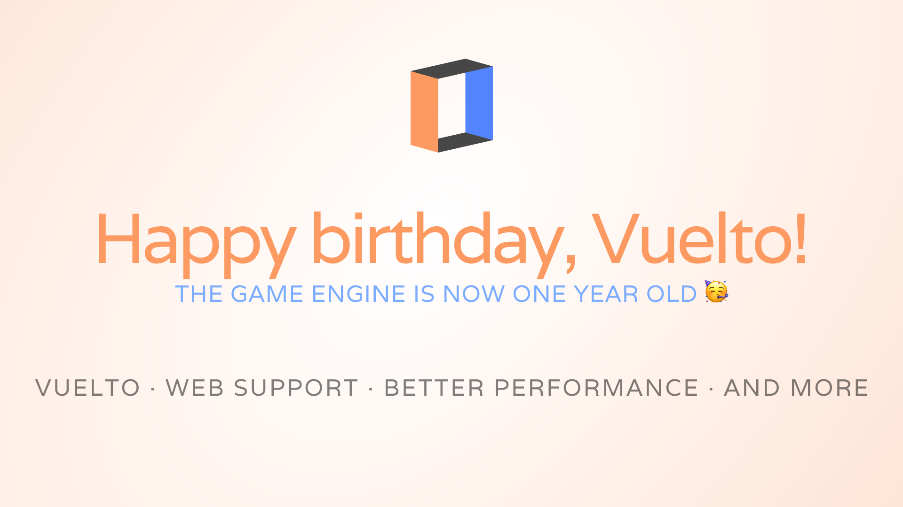
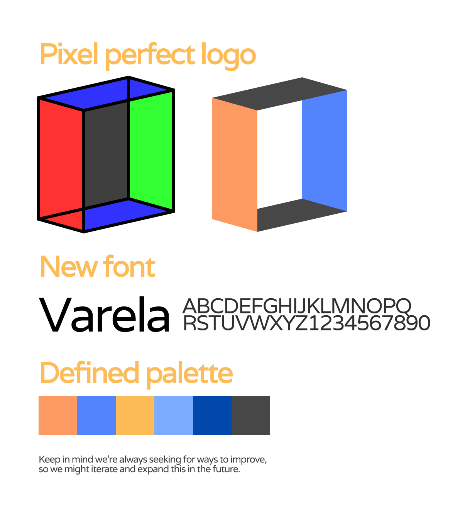

# We’re one year old\! V1.1 is coming, and it’s looking good



Hi there\! I’m [Zaka](https://github.com/ZakaHaceCosas), and I’m a new addition to the Vuelto Team, though I’ve known this engine for a while. Feels like it’s already been a year since I got to know this engine \- and indeed, it has been a year since it was made\! Today, one year ago, Vuelto was created as an alternative to [Fusion Engine](https://github.com/fusionengine-org/fusion), another engine made by the same creator.

We at Vuelto have been cooking a new release for a while now, and while it’s not ready for today as we still work on it, it’s coming soon (in fact, there’s already a [PR draft](https://github.com/vuelto-org/vuelto/pull/8)), and it’s looking pretty neat.

<!-- more -->
## New rendering system approach

Currently, Vuelto 1.0 uses a pipelined system for rendering graphics. It looks kinda like this:

```go
// …
gl.Vertex2f(x, y)
gl.Vertex2f(x+width, y)
gl.Vertex2f(x+width, y+height)
gl.Vertex2f(x, y+height)
// …
```

Version 1.1 adds new GL 3.3 Core and refactors the rendering system to be more shader based, like this:

```go
vertexShader := NewShader(VERTEX_SHADER, "vertex_shader_web.glsl", "vertex_shader_desktop.glsl")
fragmentShader := NewShader(FRAGMENT_SHADER, "fragment_shader_web.glsl", "fragment_shader_desktop.glsl")

vertexShader.Compile()
fragmentShader.Compile()

program := NewProgram(*vertexShader, *fragmentShader)
program.Link()
program.Use()
```

It doesn’t only make the code more maintainable, but it also improves performance, since we now work with GL 3.3’s shaders system.

Also, this will allow us to implement in a future release support for more advanced things like material textures and more\!

## New windowing system

We replaced Vuelto’s old windowing library with a homemade one, supporting GLFW and JS Canvases. This adds \- among other things \- web support\! In general, this new library gives us much more flexibility for cross-platforming.

Now, from a single piece of code like this one:

```go
window, err := windowing.InitWindow()
if err != nil {
    log.Fatalln("Could not initialize a new window: ", err)
    return nil
}

window.Title = title
window.Width = width
window.Height = height
window.Resizable = resizable
```

\- you now have something that works with both the web and GLFW. Under the hood, Vuelto will take care of code filtering for each platform, so you don’t gotta worry about that.

## Events\

*There’s less progress on this area* BUT \- it’s a thing, and it’s coming in V1.1\! While this is still in early stages and subject to changes, for now the idea is to make them using a boolean (`true`/`false`) structure.

Basically:

```go
if vuelto.Key["e"].Pressed == true {
 // do something
}
```

`.Pressed` will change to true as soon as the event is called, firing the code inside the block. It will turn false immediately after (as it’s a one time event) so it can be called again as many times as needed.

For data that isn’t an event *itself* but *depends* on an event (e.g. the mouse position), the idea is to provide a function to get the value. For example:

```go
vuelto.GetMousePox() // {x: 483, y: 131}
vuelto.GetMousePox().X // 483
vuelto.GetMousePox().Y // 131
```

!!! note
    Keep in mind that the function returns the value for the moment of the call.
    The value is not “reactive” like a web dev would say, so if you want to constantly keep track of the value, you’ll have to use some sort of loop.

## Better engine, better looks

The priority is to *be* a good option, but we also gotta *look like* a good option. That’s why we did some iterations on our branding\! We kept the core idea (the main logo),  but changed typefaces, colors, banners, styling, and more.



We want Vuelto to look more professional, so we’re giving it a well-needed refresh. Talking about being professional, we’re finally finishing the documentation, and we’ll also get contributing guidelines and more cool-looking documents soon.

And that’s all, my fellows\! Again, this is still in the works, V1.1 will have more (and more polished) stuff upon its final release, and we're thrilled to share more details as soon as we can.

For now, happy birthday, Vuelto\!

Onward and upward,
> \- [Zaka](https://github.com/ZakaHaceCosas), from the Vuelto Team.
